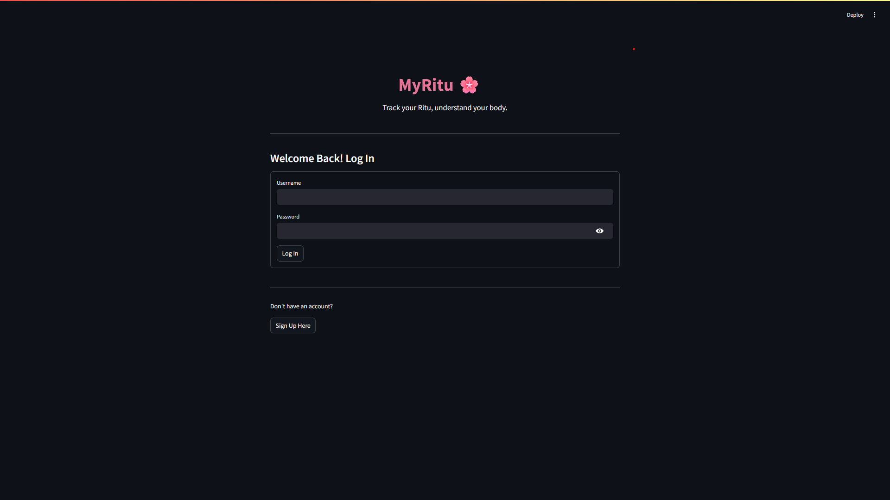
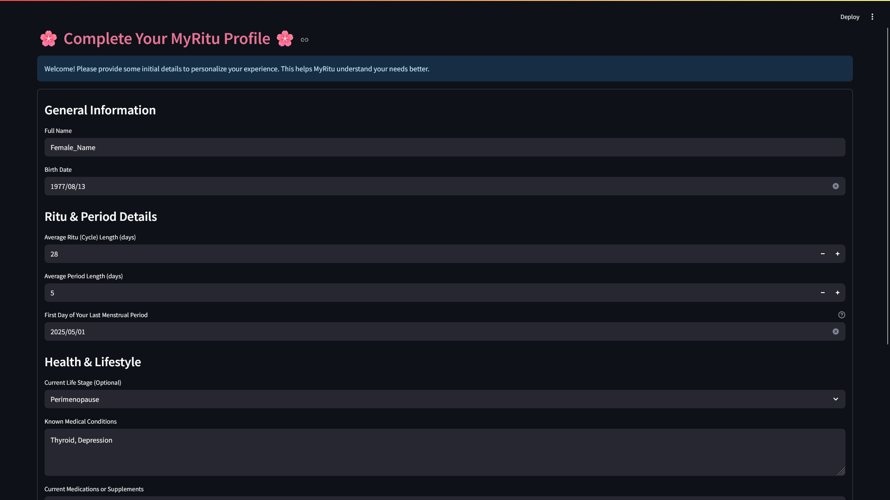
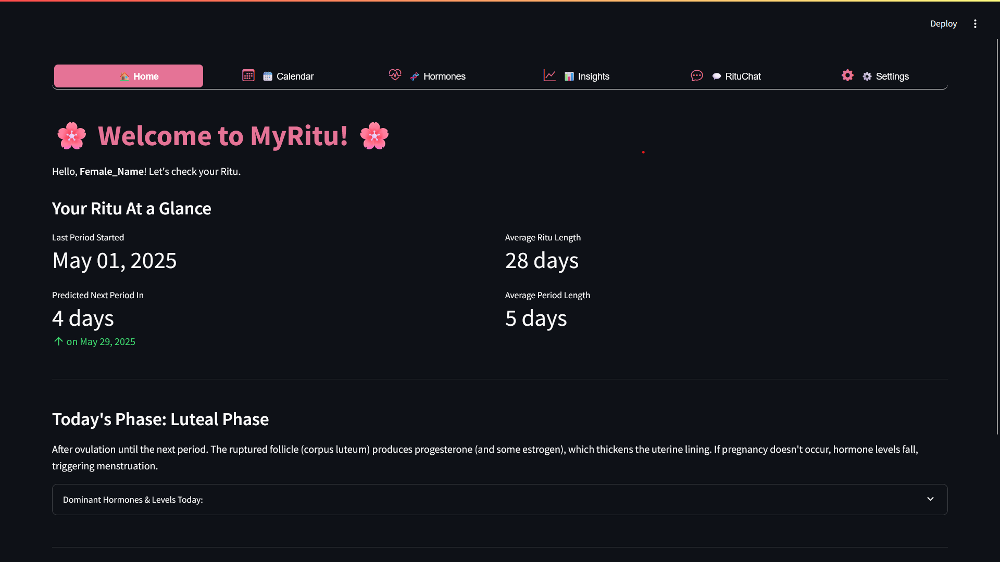
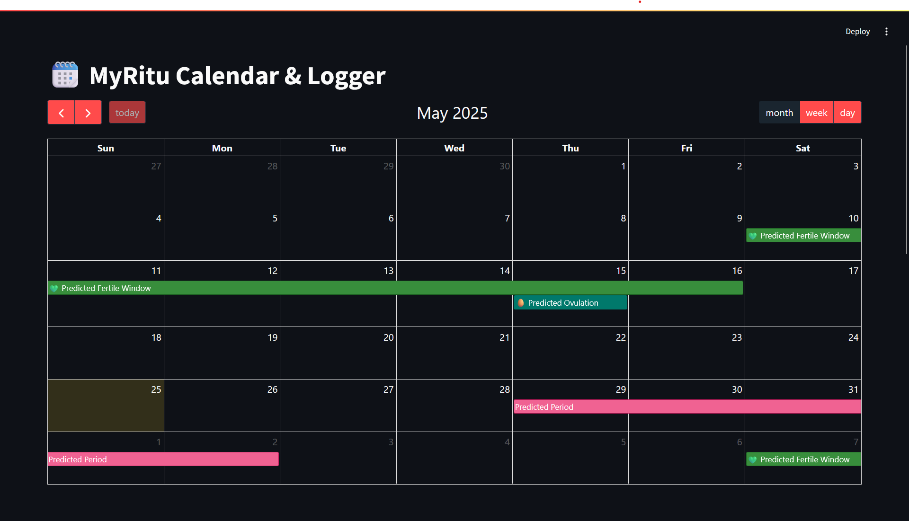
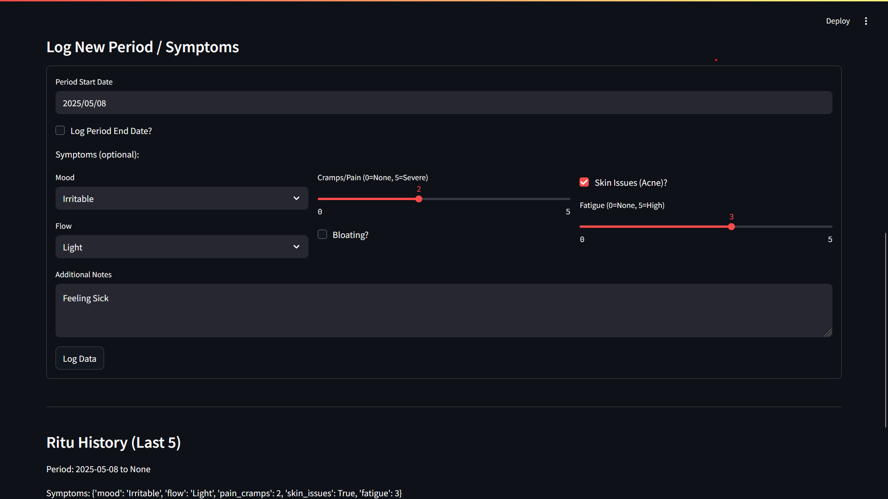

# MyRitu 🌸 - Your Personal Menstrual Ritu (Cycle) Companion

MyRitu is a user-friendly Streamlit application designed to empower women by helping them track their menstrual Ritu (cycle), understand hormonal fluctuations, log symptoms, and gain personalized insights into their reproductive health across all life stages. It features an AI-powered chat assistant to provide general information and support.

## ✨ Key Features

*   **Secure User Authentication:** Sign up, log in, and log out functionality to protect your personal data.
    *   *Login Screen:*
        
*   **Comprehensive Profile:** Store and update vital information to tailor your MyRitu experience.
    *   *Profile Setup/Edit:*
        
*   **Personalized Dashboard (Home):** At-a-glance view of your current Ritu phase, predictions, and daily hormonal insights.
    *   *Home Dashboard:*
        
*   **Interactive Calendar & Logger:** Visually track your Ritu and log symptoms with ease.

    | Calendar View                      | Symptom Logger                     |
    | :--------------------------------: | :--------------------------------: |
    |  |  |

*   **Hormone Hub:** Educational section detailing key hormones (Estrogen, Progesterone, FSH, LH) and their roles and typical levels during different Ritu phases.
*   **Ritu Insights:** Visualizations of your Ritu length variations, mood frequency, and pain level trends, complete with easy-to-understand descriptions.
*   **MyRitu AI Chat:** Engage with an empathetic AI assistant that uses your anonymized profile and Ritu data summary to provide:
    *   General information about menstrual health.
    *   Tips and tricks tailored to your age, life stage, and logged information.
    *   A caring and receptive conversational partner.
    *   *(Disclaimer: The AI chat is for informational purposes only and not a substitute for professional medical advice.)*
    *   *AI Chat Interface:*
        
*   **Data Management:**
    *   Locally persistent data using an SQLite database.
    *   Option to permanently delete all your account data via Settings.
*   **User-Friendly Interface:** Clean design with pink accents, optimized for readability. Horizontal navigation for easy access to all features.

## 🛠️ Tech Stack

*   **Frontend & Backend:** Streamlit
*   **Database:** SQLite (for local storage)
*   **AI Language Model:** Hugging Face Inference API (e.g., `HuggingFaceH4/zephyr-7b-beta`)
*   **Core Libraries:** Pandas, Plotly, Streamlit-Calendar, Streamlit-Option-Menu, Requests, Bcrypt, python-dotenv.

## 🚀 Getting Started (Local Development)

1.  **Clone the Repository:**
    ```bash
    git clone https://github.com/yourusername/MyRitu_harmony.git # Replace with your repo URL
    cd MyRitu_harmony
    ```

2.  **Create and Activate a Virtual Environment:**
    ```bash
    python -m venv venv
    # On Windows:
    venv\Scripts\activate
    # On macOS/Linux:
    source venv/bin/activate
    ```

3.  **Install Dependencies:**
    ```bash
    pip install -r requirements.txt
    ```

4.  **Set Up Hugging Face API Token:**
    *   Create a `.env` file in the project root (`MyRitu_harmony/.env`).
    *   Add your Hugging Face API token:
        ```env
        HF_API_TOKEN="your_actual_hugging_face_api_token_here"
        ```
    *   Obtain a token from [huggingface.co/settings/tokens](https://huggingface.co/settings/tokens) (a "read" token is usually sufficient).
    *   **Important:** The `.env` file is listed in `.gitignore` and should **never** be committed to your repository.

5.  **Run the Application:**
    ```bash
    streamlit run main.py
    ```
    The app will open in your default web browser.

## ☁️ Deployment (Streamlit Community Cloud)

1.  Ensure your code is pushed to a **public GitHub repository**. Your `.gitignore` file must prevent `.env` and `MyRitu.db` from being uploaded.
2.  Go to [share.streamlit.io](https://share.streamlit.io) and sign in with GitHub.
3.  Deploy a new app, selecting your repository, branch (e.g., `main`), and `main.py` as the main file.
4.  **Set Secrets:** In your deployed app's settings on Streamlit Community Cloud, add your `HF_API_TOKEN` as a secret. The key should be `HF_API_TOKEN` and the value your actual token.
5.  **Database Note:** For persistent data on Streamlit Community Cloud, the default SQLite setup will be ephemeral. For long-term data storage in a deployed app, consider integrating a cloud-based database solution.

## 🔒 Privacy & Data

*   **Authentication:** User accounts are protected by hashed passwords.
*   **Local Storage:** All user data is stored in an SQLite database (`MyRitu.db`) **locally on the device where the app is run** (during local development).
*   **Data Deletion:** Users have the option to permanently delete their account and all associated data from the local database via the Settings page.
*   **AI Chat:** A summary of your anonymized profile and recent Ritu data is sent to the Hugging Face API to provide context to the language model. Chat messages are logged locally.

## ⚠️ Disclaimer

MyRitu is intended for informational and tracking purposes only. It is **not a substitute for professional medical advice, diagnosis, or treatment.** Always seek the advice of your physician or other qualified health provider with any questions you may have regarding a medical condition or your health.

## 💖 A Note of Appreciation

This application is built with love and deep respect for all women. To the mothers who nurture, the professionals who build, the young women discovering their strength, and every woman navigating the intricate dance of her body's rhythms – you are powerful, resilient, and inspiring. May MyRitu be a small, helpful companion on your unique journey, offering a little more understanding and connection to your own well-being.

Keep shining! ✨

---

## 🤝 Contributing

Contributions, feedback, and suggestions are welcome! Please feel free to open an issue or submit a pull request.
