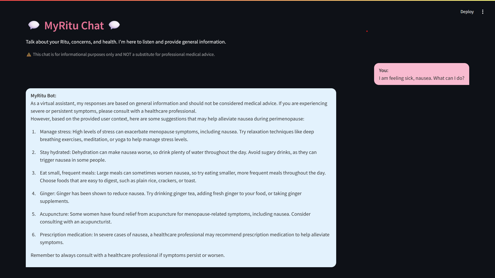

<div align="center">
  
  <h1>MyRitu 🌸</h1>
  <p><strong>Your Personal Menstrual Ritu (Cycle) Companion</strong></p>
  <p><em>Track your Ritu, understand your body, and gain personalized insights with AI support.</em></p>
</div>

<div align="center" style="background-color: #FCE4EC; padding: 15px; border-radius: 10px; margin: 20px 0;">
  <h2 style="color: #D81B60; margin-bottom: 5px;">Try MyRitu Live!</h2>
  <p style="font-size: 1.1em;">Click the link below to access the deployed application:</p>
  <a href="https://sarveshero3.github.io/MyRitu/" target="_blank" style="background-color: #E57396; color: white; padding: 10px 20px; text-decoration: none; border-radius: 5px; font-weight: bold; font-size: 1.2em;">
    🚀 Access MyRitu App
  </a>
  <p style="font-size: 0.9em; margin-top: 10px;">(This link redirects to the Streamlit application)</sup></p>
</div>

MyRitu is a user-friendly Streamlit application designed to empower women by helping them track their menstrual Ritu (cycle), understand hormonal fluctuations, log symptoms, and gain personalized insights into their reproductive health across all life stages. It features an AI-powered chat assistant to provide general information and support.

## ✨ Key Features

*   **Secure User Authentication:** Sign up, log in, and protect your personal data.
    *   *Login Screen:*
        
*   **Comprehensive Profile:** Store and update vital information including your current life stage to tailor your MyRitu experience.
    *   *Profile Setup/Edit:*
        
*   **Personalized Dashboard (Home):** At-a-glance view of your current Ritu phase, predictions, and daily hormonal insights.
    *   *Home Dashboard:*
        
*   **Interactive Calendar:** Visually track your Ritu with ease.
    *   *Calendar View:*
        
*   **Symptom Logger:** Log new period dates, symptoms (mood, flow, pain, etc.), and personal notes.
    *   *Symptom Logger:*
        
*   **Hormone Hub:** Educational section detailing key hormones and their roles.
*   **Ritu Insights:** Visualizations of your Ritu length variations, mood frequency, and pain level trends, with clear descriptions.
*   **MyRitu AI Chat:** Engage with an empathetic AI assistant using your anonymized data for tailored, general information.
    *   *AI Chat Interface:*
        
*   **Data Management & User-Friendly Interface.**

---

## 🛠️ Tech Stack

<p align="center">
  
  
  
  
  
  
</p>

*   **Core Libraries:** Streamlit-Calendar, Streamlit-Option-Menu, Requests, Bcrypt, python-dotenv, NumPy.

---

## 🚀 Getting Started (Local Development)

1.  **Clone the Repository:**
    ```bash
    git clone https://github.com/sarveshero3/MyRitu.git # Ensure this is your correct repo URL
    cd MyRitu # Or your repository name
    ```

2.  **Create and Activate a Virtual Environment:**
    ```bash
    python -m venv venv
    # Windows: venv\Scripts\activate | macOS/Linux: source venv/bin/activate
    ```

3.  **Install Dependencies:**
    ```bash
    pip install -r requirements.txt
    ```

4.  **Set Up Hugging Face API Token:**
    *   Create a `.env` file in the project root.
    *   Add: `HF_API_TOKEN="your_hugging_face_api_token_here"`
    *   (Remember: `.env` is in `.gitignore` and should NOT be committed.)

5.  **Run the Application:**
    ```bash
    streamlit run main.py
    ```

---

## ☁️ Deployment (Streamlit Community Cloud)

1.  Push code to a **public GitHub repository** (ensure `.env` and `.db` files are in `.gitignore`).
2.  Deploy via [share.streamlit.io](https://share.streamlit.io).
3.  Set `HF_API_TOKEN` as a **Secret** in your Streamlit Cloud app settings.
4.  **Database Note:** For persistent data on Streamlit Cloud, consider integrating a cloud-based database.

---

## 🔒 Privacy & Data

*   User accounts are protected by hashed passwords.
*   Data is stored locally in an SQLite database during local development.
*   Users can permanently delete their account and data via Settings.
*   Anonymized summaries are used for AI chat context with Hugging Face API.

---

## ⚠️ Disclaimer

MyRitu is for informational and tracking purposes only and is **not a substitute for professional medical advice.** Always consult a healthcare provider for medical concerns.

---

## 💖 A Note of Appreciation

This application is built with love and deep respect for all women. To the mothers who nurture, the professionals who build, the young women discovering their strength, and every woman navigating the intricate dance of her body's rhythms – you are powerful, resilient, and inspiring. May MyRitu be a small, helpful companion on your unique journey, offering a little more understanding and connection to your own well-being.

Keep shining! ✨

I Love You, Mom! ❤️

---

## 🤝 Contributing

Feedback and contributions are welcome! Please open an issue or submit a pull request.
